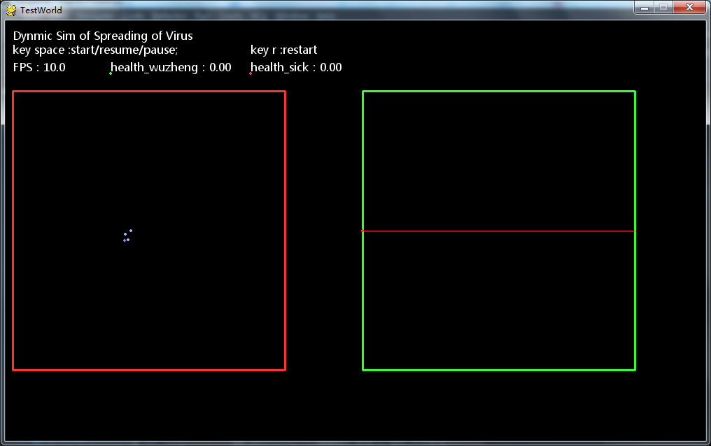

# DynSimWorld

This is a simple implementation for simulating a dynamic wolrd where virus are spreaded as people are moving and contacting.

I use pygame+agent model+monte carlo method to simulate people's state transition: including geo moving, contacting, health status and medication treatments they are in.

The core modelling is done in class sxpNCPState.InfectPersion

You may setup your own model in the function infectother()

where, you can define how people are affected by some probability model.

For example, in this simple case, I use：
    
    region = self.probsel({'pub':1-pstayhome,'home':pstayhome})

to controll how people will stay at home or go to pub by a probability defined by pstayhome, and pstayhome is defined as an inversly proportional p to the infection risk.

If stay home, the infection will be limited to the family range, otherwise, the infection will be spread open to public people, where higher probability of infecting others can be defined.

In this simple model, you will say a osicillation curves of number of infected peoples due to the probability model is being in inverse relationship to the risk probability they can sense, which will lead to a negative feedback to the whole system's runninging and finally will lead to a up and down developing of virus spreading.

There are also many places where you can model, for example, how a people's health will develop. How if they cannot get enough care and so on.

Sometimes, the case won't be spreading due to the fact that the initially infected people are recovered, so the curve will be flat.

To run the simulation, you need to run :

sxpRunNCPWorld.py

To start simulation, please press SPACE key.

To pause simulation, press SPACE key again.

To restart a simulation, press key R.

NOTE that simulation will get slower and slower as more being in high risk people are simulated.
